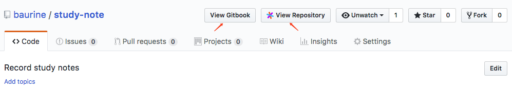

# QuickGitbook Chrome Extension

A chrome extension for [QuickGitbook](https://github.com/baurine/quick-gitbook) project, imitates [Sourcegraph](https://about.sourcegraph.com/), adds a link for gitbook repo in github page to help quickly jump to QuickGitbook website to read.

In above screenshot, the first button is injected by this extension, while the second button is injected by Sourcegraph extension.

In above page (<https://github.com/baurine/study-note>), after click the "View Gitbook" button, it will open a new tab and jump to <http://quickgitbook.com/baurine/study-note>.

[Install from chrome store](https://chrome.google.com/webstore/detail/quickgitbook-for-github/ebmjhcmlkbgbllcpkhokokjgchpoepfj).

## TODO

- [x] Only show "View Gitbook" link when contains "SUMMARY.md"
- [x] Publish to chrome store
- [x] Make "http://quickgitbook.com" host configurable, because you maybe deploy the "QuickGitbook" project to yourself server
